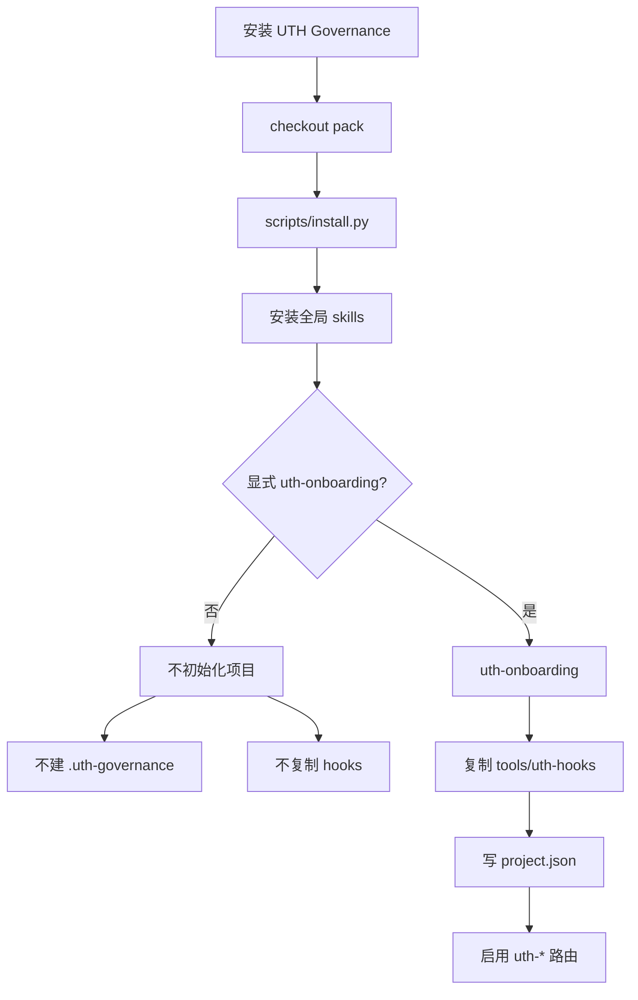
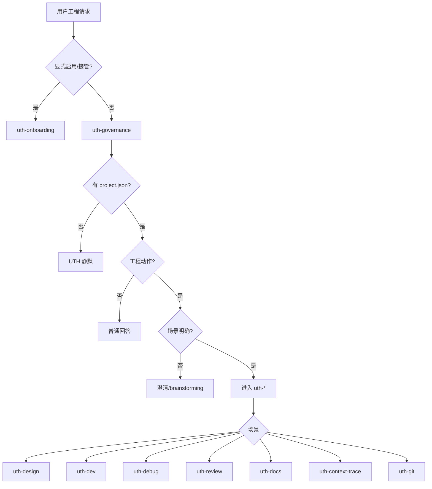
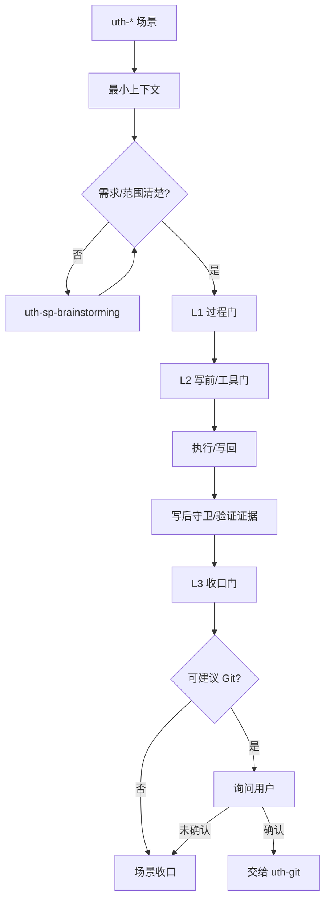
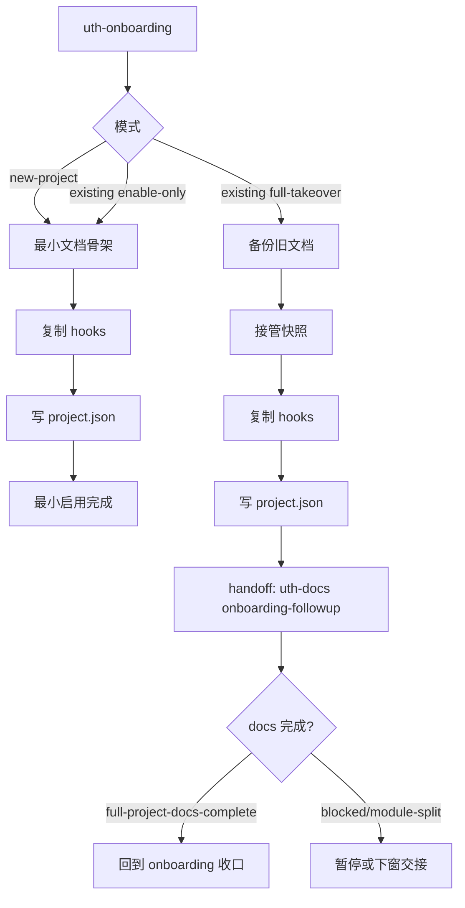
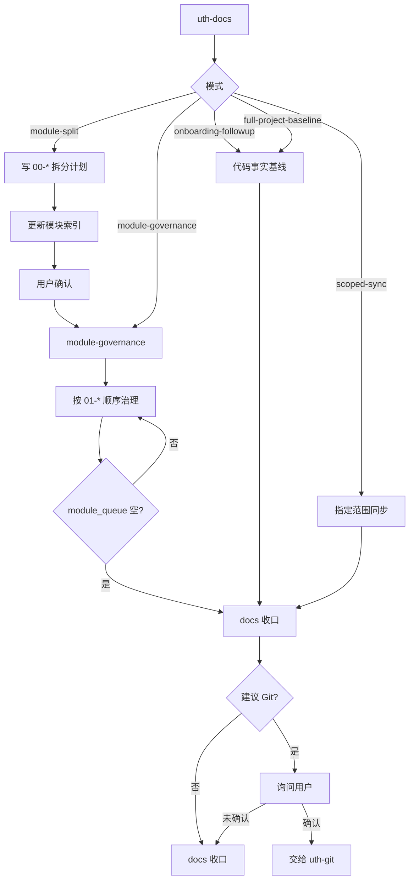
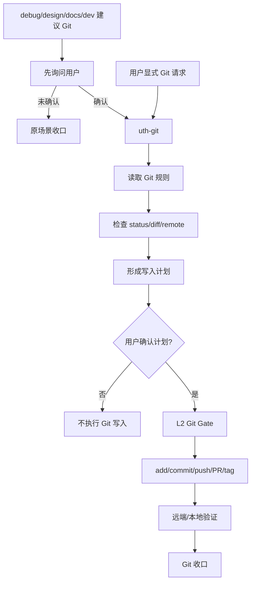
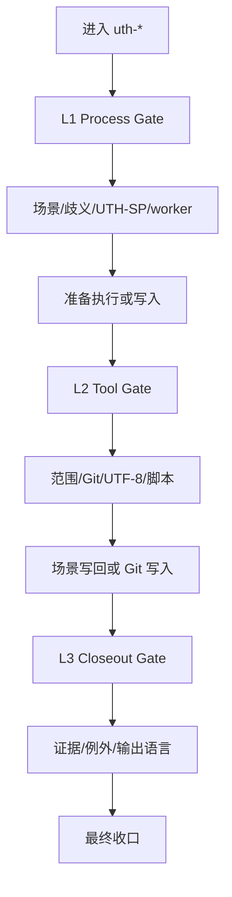

# UTH Governance 全链路流程图

## 0. 安装与启用边界

## 1. 总览路由

## 2. 场景内执行

## 3. onboarding 接管

## 4. docs 治理地图

## 5. Git 收口边界

## 6. Hook 门禁位置

## Notes

- 场景规则、进入条件、收口语义见 `docs/AGENT_工程治理启动手册.md`。
- Hook 事件字段、L1/L2/L3 门禁证据见 `docs/HOOKS_工程治理门禁手册.md`。
