# UTH Governance 全链路流程图

本文件画 UTH Governance 的纵向流程图谱。这里的 `UTH-SP` 指改造后保留在本包内的 `uth-sp-*` 方法 Skill，也就是从 Superpower 流程中拆出并纳入 UTH 调度的成熟方法流程。

详细规则仍以各场景 Skill、`docs/AGENT_工程治理启动手册.md`、`docs/HOOKS_工程治理门禁手册.md` 和 `docs/TEMPLATES_工程治理模板.md` 为准。

## 0. 安装与项目启用边界

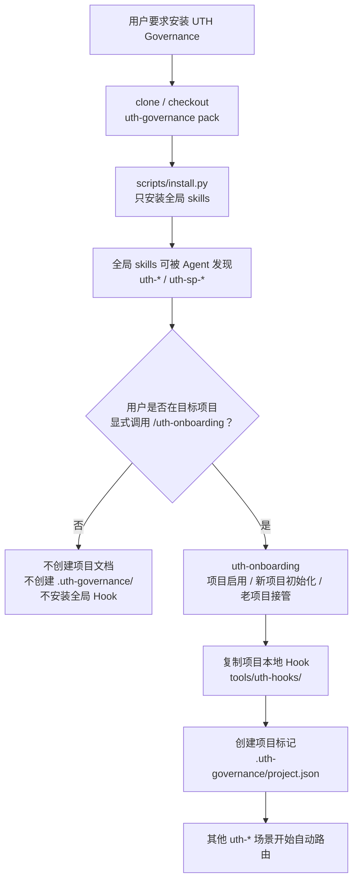

## 1. 全链路总览

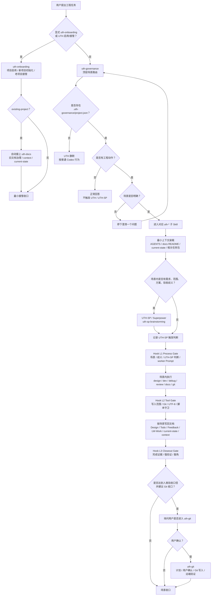

## 2. uth-governance 场景路由

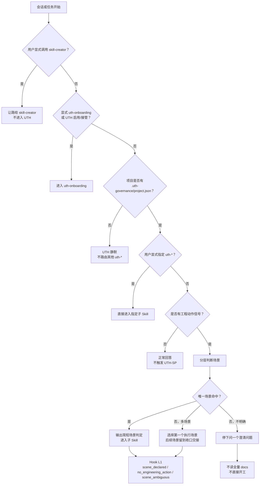

说明：`uth-governance` 不直接调用 UTH-SP / Superpower。UTH-SP 触发判断由进入的子 Skill 负责。

## 2.1 uth-onboarding 项目启用 / 接管

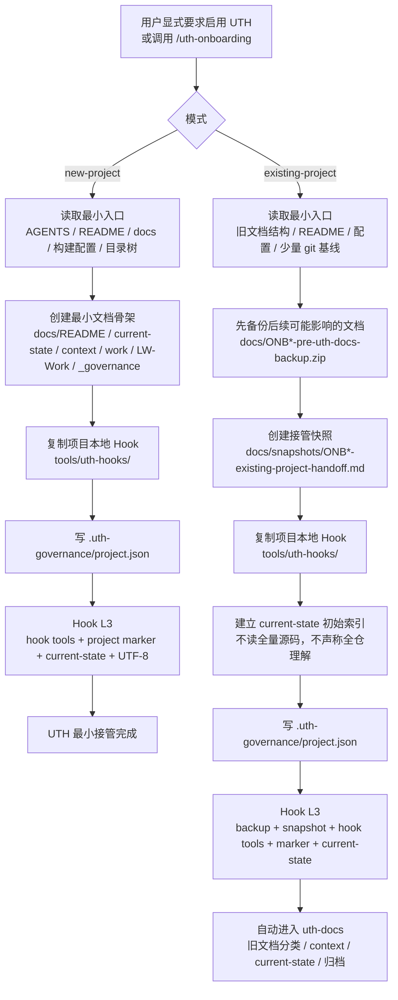

## 3. uth-design 方案评估 / 架构设计

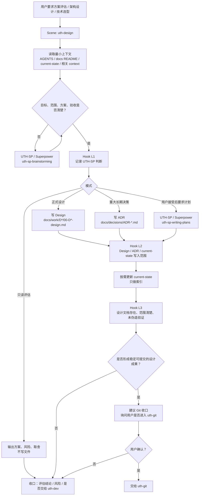

补充：`uth-design` 默认不写 Todo；Todo 拆分由 `uth-dev` 负责。设计场景如经用户确认做少量代码补丁，必须走 L2 写入范围和 L3 代码强验证。设计场景是否建议 Git 收口由 Agent 判断，但进入 `uth-git` 仍需用户确认。

## 4. uth-dev 增量开发

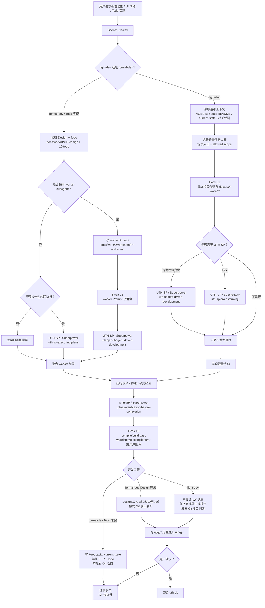

## 5. uth-debug 故障定位 / 修复

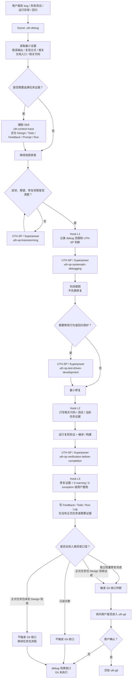

## 6. uth-review 审查 / 验收

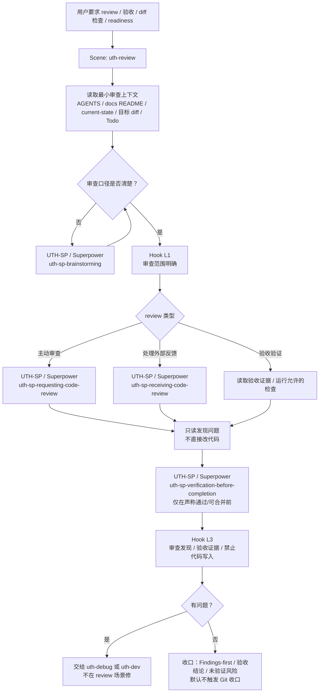

## 7. uth-docs 单开文档治理

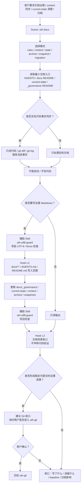

说明：`uth-docs` 通常不调用 UTH-SP / Superpower；若文档治理目标、范围或验收不清，可以由场景内判断进入 `uth-sp-brainstorming`。

## 8. uth-git Git / PR / 发布收口

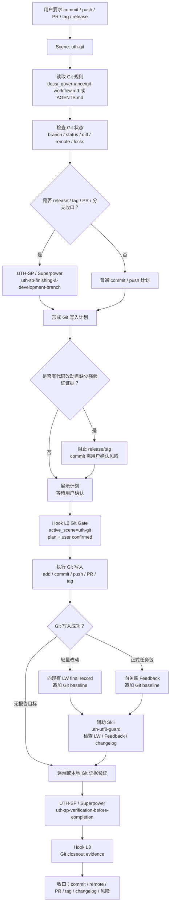

## 9. uth-context-trace 文档定位 / 证据追踪

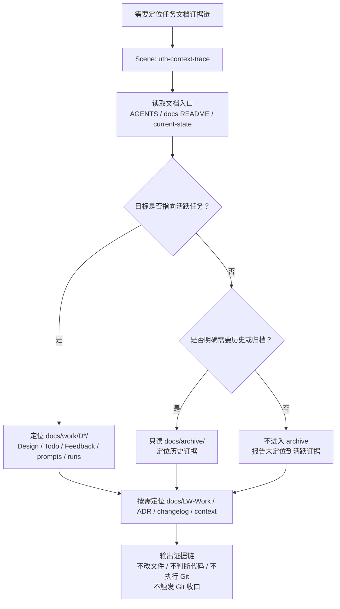

说明：`uth-context-trace` 是只读辅助 Skill，不调用 UTH-SP，不替代代码搜索，也不负责修复或审查。

## 10. uth-utf8-guard 文档编码守卫

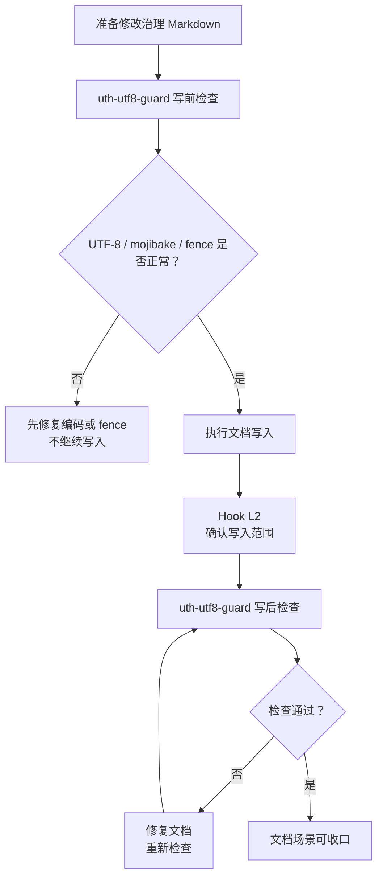

## 11. Hook 门禁位置总览

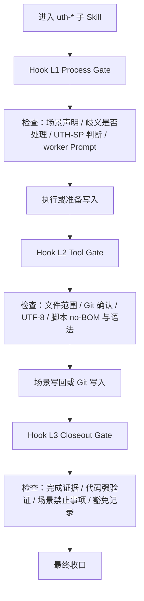

## 图例

- `uth-governance` 只负责顶层场景路由，不直接调用 UTH-SP / Superpower。
- `uth-*` 子 Skill 负责场景内上下文装载、UTH-SP 触发判断、执行边界、文档写回和收口协议。
- `UTH-SP / Superpower` 节点表示调用本包内 `skills/uth-sp-*` 方法 Skill。
- Hook 是门禁，不是流程；它只检查调用方提供的场景、范围、确认和验证事实。
- `docs/LW-Work/` 属于轻量开发记录；正式任务包放在 `docs/work/DYYMMDDXX-*`。
