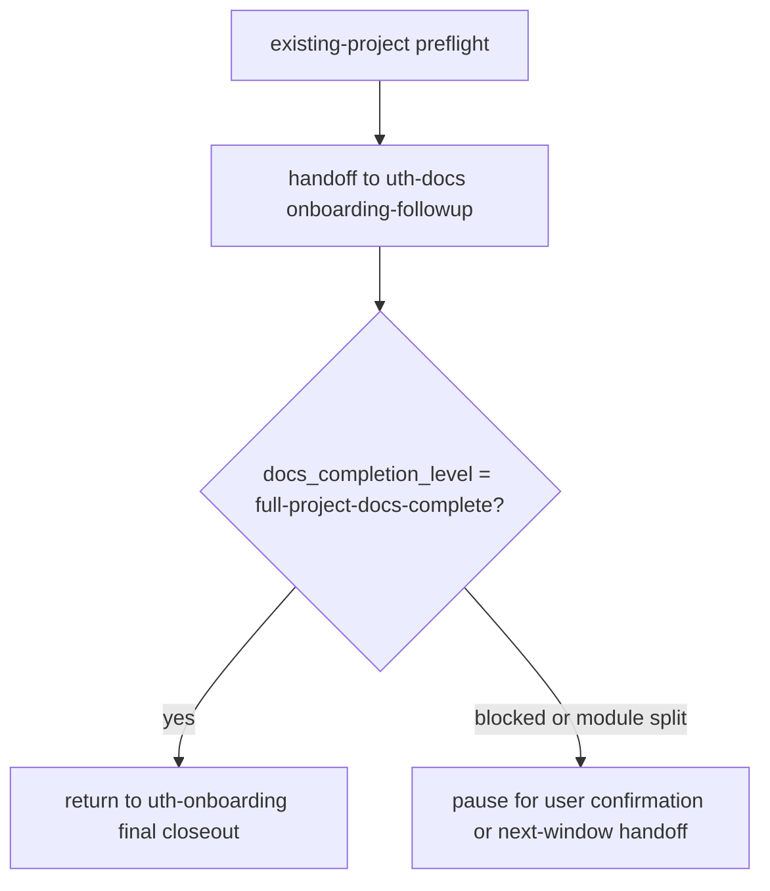

# Existing Project Takeover and Docs Baseline Implementation Plan

> **For agentic workers:** REQUIRED SUB-SKILL: Use superpowers:subagent-driven-development (recommended) or superpowers:executing-plans to implement this plan task-by-task. Steps use checkbox (`- [ ]`) syntax for tracking.

**Goal:** Make old-project takeover and `uth-docs` documentation governance match the approved design: onboarding orchestrates full takeover, `uth-docs` owns code-fact documentation baselines, and completion claims are blocked unless the required evidence is present.

**Architecture:** Keep responsibilities separated. `uth-onboarding` becomes the existing-project takeover orchestrator, `uth-docs` becomes the documentation baseline executor, and L3 closeout gates enforce the difference between preflight, scoped docs completion, full-project docs completion, module-split pauses, and final takeover completion.

**Tech Stack:** Markdown skills and docs, Python 3 standard library hook runner, `unittest`, JSON Schema, Mermaid documentation, repository verification through `scripts/verify.py`.

---

## Implementation Constraints

- This repository is the UTH governance pack itself; active workflow is local Superpower from `.superpower/`, not UTH project scenes.
- Before editing files under `skills/**`, implementation must use the local skill-maintenance route required by `AGENTS.md`.
- Do not execute Git writes during implementation. Replace commit steps with local checkpoints and leave Git closure for explicit user confirmation.
- Keep root `tools/uth-hooks/` and `skills/uth-onboarding/assets/uth-hooks/` synchronized.
- Use `apply_patch` for manual edits.
- Run UTF-8/fence checks after governance Markdown edits.

## File Structure

- Modify `tools/uth-hooks/tests/test_l3_closeout.py`: add failing tests for docs completion levels, module split, backup-protected cleanup, and final takeover closeout.
- Modify `tools/uth-hooks/uth_hooks/l3_closeout.py`: add L3 evidence checks for `uth-docs` and `uth-onboarding` takeover finalization.
- Modify `tools/uth-hooks/schemas/closeout-evidence.schema.json`: document the new closeout evidence fields.
- Mirror the hook bundle into `skills/uth-onboarding/assets/uth-hooks/` with `python scripts/check_assets_sync.py --sync`.
- Modify `skills/uth-docs/SKILL.md`: redefine docs as code-fact baseline governance, add full-project/scoped/module-split completion boundaries.
- Modify `skills/uth-onboarding/SKILL.md`: redefine existing-project takeover as orchestrated preflight -> docs follow-up -> final closeout.
- Modify `README.md` and `README.zh-CN.md`: expose old-project takeover and `uth-docs` baseline semantics.
- Modify `docs/AGENT_工程治理启动手册.md`: update the handbook sections for old-project takeover and standalone docs governance.
- Modify `docs/FLOW_全链路流程图.md`: update the onboarding/docs flow diagrams.
- Modify `docs/HOOKS_工程治理门禁手册.md`: document the new L3 evidence fields and blocking rules.
- Keep `docs/superpowers/specs/2026-05-17-existing-project-takeover-design.md` as design input.

## Task 1: Add Failing L3 Closeout Tests

**Files:**
- Modify: `tools/uth-hooks/tests/test_l3_closeout.py`
- Read: `tools/uth-hooks/tests/helpers.py`

- [ ] **Step 1: Add tests for `uth-docs onboarding-followup` full-project requirements**

Append these methods inside `TestL3Closeout` before the `if __name__ == "__main__":` block:

```python
    def test_docs_onboarding_followup_requires_full_project_completion(self):
        findings = check_l3_closeout(
            {
                "active_scene": "uth-docs",
                "mode": "onboarding-followup",
                "docs_completion_level": "scoped-docs-complete",
                "changed_files": ["docs/context/README.md"],
                "utf8_guard_passed": True,
                "project_marker_document_language": True,
                "closeout_report_language_applied": True,
                "context_source_evidence": ["read first-party source and build config"],
                "claims": ["项目完整文档治理完成"],
                "verification": {"evidence": ["docs closeout evidence supplied"]},
            }
        )

        assert_has(findings, "BLOCK", "docs-full-project-required")

    def test_docs_onboarding_followup_blocks_unclassified_old_docs(self):
        findings = check_l3_closeout(
            {
                "active_scene": "uth-docs",
                "mode": "onboarding-followup",
                "docs_completion_level": "full-project-docs-complete",
                "full_project_baseline_completed": True,
                "baseline_source_scope": ["src", "build.gradle.kts", "settings.gradle.kts", "docs"],
                "baseline_excluded_paths": [".git", "build", ".gradle"],
                "old_docs_unclassified_count": 2,
                "current_state_cleaned": True,
                "context_rebuilt_or_confirmed": True,
                "changed_files": ["docs/context/README.md"],
                "utf8_guard_passed": True,
                "project_marker_document_language": True,
                "closeout_report_language_applied": True,
                "context_source_evidence": ["full-project baseline"],
            }
        )

        assert_has(findings, "BLOCK", "old-docs-unclassified")
```

- [ ] **Step 2: Add tests for cleanup protection by backup zip**

Append:

```python
    def test_docs_cleanup_moved_paths_must_be_verified_in_backup_zip(self):
        findings = check_l3_closeout(
            {
                "active_scene": "uth-docs",
                "mode": "onboarding-followup",
                "docs_completion_level": "full-project-docs-complete",
                "full_project_baseline_completed": True,
                "baseline_source_scope": ["src", "docs"],
                "baseline_excluded_paths": [".git", "build"],
                "old_docs_unclassified_count": 0,
                "current_state_cleaned": True,
                "context_rebuilt_or_confirmed": True,
                "cleanup_paths_modified": ["OLD_README.md"],
                "cleanup_paths_verified_in_backup_zip": False,
                "changed_files": ["docs/archive/OLD_README.md"],
                "archive_paths_listed": True,
                "current_state_active_cleaned": True,
                "utf8_guard_passed": True,
                "project_marker_document_language": True,
                "closeout_report_language_applied": True,
                "context_source_evidence": ["full-project baseline"],
            }
        )

        assert_has(findings, "BLOCK", "cleanup-backup-verification-missing")
```

- [ ] **Step 3: Add tests for `scoped-docs-complete` boundaries**

Append:

```python
    def test_scoped_docs_completion_requires_existing_trusted_baseline(self):
        findings = check_l3_closeout(
            {
                "active_scene": "uth-docs",
                "mode": "scoped-sync",
                "docs_completion_level": "scoped-docs-complete",
                "scoped_source_scope": "git diff HEAD~1..HEAD",
                "scoped_impact_traced": True,
                "baseline_still_trusted": True,
                "changed_files": ["docs/context/backend.md"],
                "utf8_guard_passed": True,
                "project_marker_document_language": True,
                "closeout_report_language_applied": True,
                "context_source_evidence": ["git diff HEAD~1..HEAD"],
            }
        )

        assert_has(findings, "BLOCK", "scoped-baseline-missing")

    def test_scoped_docs_completion_passes_with_trusted_baseline_and_impact_trace(self):
        findings = check_l3_closeout(
            {
                "active_scene": "uth-docs",
                "mode": "scoped-sync",
                "docs_completion_level": "scoped-docs-complete",
                "trusted_full_project_baseline": True,
                "scoped_source_scope": "git diff HEAD~1..HEAD",
                "scoped_impact_traced": True,
                "baseline_still_trusted": True,
                "changed_files": ["docs/context/backend.md"],
                "utf8_guard_passed": True,
                "project_marker_document_language": True,
                "closeout_report_language_applied": True,
                "context_source_evidence": ["git diff HEAD~1..HEAD"],
            }
        )

        assert_has(findings, "PASS", "l3-closeout-pass")
```

- [ ] **Step 4: Add tests for module-split pausing and cross-window handoff**

Append:

```python
    def test_docs_module_split_requires_report_index_and_pause(self):
        findings = check_l3_closeout(
            {
                "active_scene": "uth-docs",
                "mode": "module-split",
                "module_split_confirmed_by_user": True,
                "module_split_report_written": True,
                "module_context_index_written": False,
                "module_queue": ["backend", "frontend"],
                "paused_for_user_confirmation": False,
                "changed_files": ["docs/context/README.md"],
                "utf8_guard_passed": True,
                "project_marker_document_language": True,
                "closeout_report_language_applied": True,
                "context_source_evidence": ["directory tree and build config"],
            }
        )

        assert_has(findings, "BLOCK", "module-context-index-missing")
        assert_has(findings, "BLOCK", "module-split-pause-missing")

    def test_docs_module_governance_requires_pause_after_each_module(self):
        findings = check_l3_closeout(
            {
                "active_scene": "uth-docs",
                "mode": "module-governance",
                "module_current": "backend",
                "module_completed": ["backend"],
                "module_queue": ["frontend"],
                "module_context_report_written": True,
                "module_source_evidence": ["backend/src", "backend/pom.xml"],
                "module_pause_after_each_completed": False,
                "changed_files": ["docs/context/backend.md"],
                "utf8_guard_passed": True,
                "project_marker_document_language": True,
                "closeout_report_language_applied": True,
                "context_source_evidence": ["backend module source"],
            }
        )

        assert_has(findings, "BLOCK", "module-governance-pause-missing")

    def test_docs_long_context_handoff_requires_light_dev_record_and_prompt(self):
        findings = check_l3_closeout(
            {
                "active_scene": "uth-docs",
                "mode": "module-governance",
                "context_too_long": True,
                "lw_final_record_written": True,
                "handoff_prompt_for_new_window": "",
                "changed_files": ["docs/LW-Work/LW26051701-docs-module-split.md"],
                "utf8_guard_passed": True,
                "project_marker_document_language": True,
                "closeout_report_language_applied": True,
                "context_source_evidence": ["module governance state"],
            }
        )

        assert_has(findings, "BLOCK", "handoff-prompt-missing")
```

- [ ] **Step 5: Add tests for final `uth-onboarding` takeover closeout**

Append:

```python
    def test_onboarding_final_takeover_requires_docs_followup_completion(self):
        findings = check_l3_closeout(
            {
                "active_scene": "uth-onboarding",
                "mode": "existing-project",
                "takeover_final_closeout": True,
                "project_marker_written": True,
                "current_state_written": True,
                "hook_tools_copied": True,
                "backup_zip_created": True,
                "handoff_snapshot_created": True,
                "next_scene": "uth-docs",
                "docs_followup_completed": False,
                "return_to_onboarding": True,
                "backup_zip_reported_to_user": True,
                "changed_files": ["docs/current-state.md"],
                "utf8_guard_passed": True,
                "project_marker_document_language": True,
                "closeout_report_language_applied": True,
                "claims": ["老项目接管完成"],
                "verification": {"evidence": ["takeover final closeout evidence"]},
            }
        )

        assert_has(findings, "BLOCK", "takeover-docs-followup-missing")

    def test_onboarding_final_takeover_passes_with_full_docs_completion(self):
        findings = check_l3_closeout(
            {
                "active_scene": "uth-onboarding",
                "mode": "existing-project",
                "takeover_final_closeout": True,
                "project_marker_written": True,
                "current_state_written": True,
                "hook_tools_copied": True,
                "backup_zip_created": True,
                "handoff_snapshot_created": True,
                "next_scene": "uth-docs",
                "docs_followup_completed": True,
                "docs_completion_level": "full-project-docs-complete",
                "return_to_onboarding": True,
                "backup_zip_reported_to_user": True,
                "old_docs_unclassified_count": 0,
                "active_takeover_blockers": [],
                "changed_files": ["docs/current-state.md"],
                "utf8_guard_passed": True,
                "project_marker_document_language": True,
                "closeout_report_language_applied": True,
                "claims": ["老项目接管完成"],
                "verification": {"evidence": ["takeover final closeout evidence"]},
            }
        )

        assert_has(findings, "PASS", "l3-closeout-pass")
```

- [ ] **Step 6: Run the tests and confirm they fail for the new codes**

Run:

```powershell
python -m unittest tools.uth-hooks.tests.test_l3_closeout
```

Expected: FAIL, because the new L3 codes are not implemented yet. If PowerShell cannot import the dotted module path because of the hyphen in `uth-hooks`, run:

```powershell
python -m unittest discover -s tools/uth-hooks/tests -p test_l3_closeout.py
```

Expected: FAIL with missing expected codes such as `docs-full-project-required`, `cleanup-backup-verification-missing`, `module-context-index-missing`, and `takeover-docs-followup-missing`.

- [ ] **Step 7: Checkpoint instead of commit**

Run:

```powershell
git diff -- tools/uth-hooks/tests/test_l3_closeout.py
```

Expected: diff shows only new tests in `tools/uth-hooks/tests/test_l3_closeout.py`.

## Task 2: Implement L3 Closeout Evidence Checks

**Files:**
- Modify: `tools/uth-hooks/uth_hooks/l3_closeout.py`
- Test: `tools/uth-hooks/tests/test_l3_closeout.py`

- [ ] **Step 1: Add helper functions near `document_language_ready`**

Insert these helpers before `document_language_ready`:

```python
DOCS_COMPLETION_LEVELS = {
    "full-project-docs-complete",
    "scoped-docs-complete",
    "blocked",
    "partial/paused",
}


def text_value(ctx: dict[str, Any], key: str) -> str:
    return str(ctx.get(key, "")).strip()


def non_empty_list(ctx: dict[str, Any], key: str) -> bool:
    return bool(listify(ctx.get(key)))


def list_count(ctx: dict[str, Any], count_key: str, list_key: str) -> int:
    count = parse_int(ctx.get(count_key))
    if count is not None:
        return count
    return len(listify(ctx.get(list_key)))


def docs_completion_level(ctx: dict[str, Any]) -> str:
    return text_value(ctx, "docs_completion_level")
```

- [ ] **Step 2: Add `check_onboarding_takeover_final`**

Insert after `check_l3_onboarding` or before it:

```python
def check_onboarding_takeover_final(ctx: dict[str, Any]) -> list[dict[str, Any]]:
    if not as_bool(ctx.get("takeover_final_closeout")):
        return []

    findings: list[dict[str, Any]] = []
    if not as_bool(ctx.get("docs_followup_completed")):
        findings.append(result("BLOCK", "takeover-docs-followup-missing", "Final existing-project takeover requires completed uth-docs onboarding-followup evidence."))
    if docs_completion_level(ctx) != "full-project-docs-complete":
        findings.append(result("BLOCK", "takeover-full-docs-completion-missing", "Final existing-project takeover requires docs_completion_level=full-project-docs-complete."))
    if not as_bool(ctx.get("return_to_onboarding")):
        findings.append(result("BLOCK", "takeover-return-missing", "Final existing-project takeover must return from uth-docs to uth-onboarding for total closeout."))
    if not as_bool(ctx.get("backup_zip_reported_to_user")):
        findings.append(result("BLOCK", "takeover-backup-report-missing", "Final existing-project takeover must report the backup zip path to the user."))
    if list_count(ctx, "old_docs_unclassified_count", "old_docs_unclassified") > 0:
        findings.append(result("BLOCK", "takeover-old-docs-unclassified", "Final existing-project takeover cannot leave old docs unclassified."))
    if non_empty_list(ctx, "active_takeover_blockers"):
        findings.append(result("BLOCK", "takeover-active-blockers", "Final existing-project takeover cannot have active takeover blockers."))
    return findings
```

Then add this line inside `check_l3_onboarding` after the existing `mode == "existing-project"` block:

```python
        findings.extend(check_onboarding_takeover_final(ctx))
```

- [ ] **Step 3: Add docs completion dispatch inside `check_l3_docs`**

At the end of `check_l3_docs`, before the `tests_run` / `compile_run` warning or immediately before `return findings`, add:

```python
    findings.extend(check_l3_docs_completion(ctx))
```

If adding before the `tests_run` warning makes output order harder to read, add it after the warning and before `return findings`.

- [ ] **Step 4: Implement docs completion checks**

Insert these functions before `check_l3_git`:

```python
def check_l3_docs_completion(ctx: dict[str, Any]) -> list[dict[str, Any]]:
    findings: list[dict[str, Any]] = []
    level = docs_completion_level(ctx)
    if level and level not in DOCS_COMPLETION_LEVELS:
        findings.append(result("BLOCK", "docs-completion-level-invalid", f"Unknown docs_completion_level: {level}."))

    mode = ctx.get("mode")
    if mode == "onboarding-followup":
        findings.extend(check_docs_onboarding_followup(ctx))
    if level == "full-project-docs-complete":
        findings.extend(check_docs_full_project_completion(ctx))
    if level == "scoped-docs-complete":
        findings.extend(check_docs_scoped_completion(ctx))
    if mode == "module-split":
        findings.extend(check_docs_module_split(ctx))
    if mode == "module-governance":
        findings.extend(check_docs_module_governance(ctx))
    findings.extend(check_docs_cleanup_backup(ctx))
    return findings


def check_docs_onboarding_followup(ctx: dict[str, Any]) -> list[dict[str, Any]]:
    findings: list[dict[str, Any]] = []
    if docs_completion_level(ctx) != "full-project-docs-complete":
        findings.append(result("BLOCK", "docs-full-project-required", "uth-docs onboarding-followup must finish with full-project-docs-complete."))
    if not as_bool(ctx.get("full_project_baseline_completed")):
        findings.append(result("BLOCK", "docs-full-project-baseline-missing", "uth-docs onboarding-followup requires a completed full-project baseline."))
    if list_count(ctx, "old_docs_unclassified_count", "old_docs_unclassified") > 0:
        findings.append(result("BLOCK", "old-docs-unclassified", "uth-docs onboarding-followup cannot leave old docs unclassified."))
    if non_empty_list(ctx, "active_takeover_blockers"):
        findings.append(result("BLOCK", "active-takeover-blockers", "uth-docs onboarding-followup cannot close with active takeover blockers."))
    if not as_bool(ctx.get("current_state_cleaned")):
        findings.append(result("BLOCK", "takeover-current-state-not-cleaned", "uth-docs onboarding-followup must clean current-state."))
    if not as_bool(ctx.get("context_rebuilt_or_confirmed")):
        findings.append(result("BLOCK", "takeover-context-not-rebuilt", "uth-docs onboarding-followup must rebuild or confirm context."))
    return findings


def check_docs_full_project_completion(ctx: dict[str, Any]) -> list[dict[str, Any]]:
    findings: list[dict[str, Any]] = []
    if not as_bool(ctx.get("full_project_baseline_completed")):
        findings.append(result("BLOCK", "docs-full-project-baseline-missing", "full-project-docs-complete requires full_project_baseline_completed."))
    if not non_empty_list(ctx, "baseline_source_scope") and not ctx.get("baseline_source_scope"):
        findings.append(result("BLOCK", "docs-baseline-scope-missing", "full-project-docs-complete requires baseline_source_scope."))
    if not (non_empty_list(ctx, "baseline_excluded_paths") or ctx.get("baseline_excluded_reason")):
        findings.append(result("BLOCK", "docs-baseline-exclusions-missing", "full-project-docs-complete requires excluded paths or an exclusion reason."))
    unresolved = (
        list_count(ctx, "unread_critical_module_count", "unread_critical_modules")
        + list_count(ctx, "unconfirmed_entrypoint_count", "unconfirmed_entrypoints")
        + list_count(ctx, "unconfirmed_verification_path_count", "unconfirmed_verification_paths")
        + list_count(ctx, "unresolved_doc_conflict_count", "unresolved_doc_conflicts")
    )
    if unresolved > 0:
        findings.append(result("BLOCK", "docs-baseline-unresolved-facts", "full-project-docs-complete cannot leave unresolved critical facts."))
    if as_bool(ctx.get("module_split_required")) and non_empty_list(ctx, "module_queue"):
        findings.append(result("BLOCK", "module-queue-incomplete", "full-project-docs-complete cannot close while module_queue is not empty."))
    return findings


def check_docs_scoped_completion(ctx: dict[str, Any]) -> list[dict[str, Any]]:
    findings: list[dict[str, Any]] = []
    if not as_bool(ctx.get("trusted_full_project_baseline")):
        findings.append(result("BLOCK", "scoped-baseline-missing", "scoped-docs-complete requires an existing trusted full-project baseline."))
    if not (ctx.get("scoped_source_scope") or ctx.get("git_range") or ctx.get("commit") or ctx.get("tag") or ctx.get("module_scope")):
        findings.append(result("BLOCK", "scoped-source-scope-missing", "scoped-docs-complete requires the diff, range, version, module, or file scope."))
    if not as_bool(ctx.get("scoped_impact_traced")):
        findings.append(result("BLOCK", "scoped-impact-trace-missing", "scoped-docs-complete requires impact tracing."))
    if not as_bool(ctx.get("baseline_still_trusted")):
        findings.append(result("BLOCK", "scoped-baseline-trust-missing", "scoped-docs-complete requires baseline_still_trusted."))
    return findings


def check_docs_module_split(ctx: dict[str, Any]) -> list[dict[str, Any]]:
    findings: list[dict[str, Any]] = []
    if not as_bool(ctx.get("module_split_confirmed_by_user")):
        findings.append(result("ASK", "module-split-confirmation-missing", "Module split requires user confirmation before writing module reports."))
    if not as_bool(ctx.get("module_split_report_written")):
        findings.append(result("BLOCK", "module-split-report-missing", "module-split requires a written split report."))
    if not as_bool(ctx.get("module_context_index_written")):
        findings.append(result("BLOCK", "module-context-index-missing", "module-split requires docs/context/README.md or equivalent module index."))
    if not non_empty_list(ctx, "module_queue"):
        findings.append(result("BLOCK", "module-queue-missing", "module-split requires an ordered module_queue."))
    if not as_bool(ctx.get("paused_for_user_confirmation")):
        findings.append(result("BLOCK", "module-split-pause-missing", "module-split must pause for user confirmation after writing the split result."))
    return findings


def check_docs_module_governance(ctx: dict[str, Any]) -> list[dict[str, Any]]:
    findings: list[dict[str, Any]] = []
    if as_bool(ctx.get("module_context_report_written")) and not non_empty_list(ctx, "module_source_evidence"):
        findings.append(result("BLOCK", "module-source-evidence-missing", "Module context report requires module_source_evidence."))
    if non_empty_list(ctx, "module_completed") and not as_bool(ctx.get("module_pause_after_each_completed")):
        findings.append(result("BLOCK", "module-governance-pause-missing", "Module governance must pause after each completed module."))
    if as_bool(ctx.get("context_too_long")):
        if not as_bool(ctx.get("lw_final_record_written")):
            findings.append(result("BLOCK", "lw-final-record-missing", "Long-context module governance requires an LW final record for handoff."))
        if not ctx.get("handoff_prompt_for_new_window"):
            findings.append(result("BLOCK", "handoff-prompt-missing", "Long-context module governance requires a new-window handoff prompt."))
    if as_bool(ctx.get("resumed_from_new_window")) and not as_bool(ctx.get("read_lw_final_record")):
        findings.append(result("BLOCK", "resumed-record-not-read", "Cross-window module governance must read the LW final record before continuing."))
    return findings


def check_docs_cleanup_backup(ctx: dict[str, Any]) -> list[dict[str, Any]]:
    if not non_empty_list(ctx, "cleanup_paths_modified"):
        return []
    if as_bool(ctx.get("cleanup_paths_verified_in_backup_zip")):
        return []
    return [
        result(
            "BLOCK",
            "cleanup-backup-verification-missing",
            "Deleting or moving original old docs requires proof that each path exists in the backup zip.",
        )
    ]
```

- [ ] **Step 5: Run the targeted L3 tests**

Run:

```powershell
python -m unittest discover -s tools/uth-hooks/tests -p test_l3_closeout.py
```

Expected: PASS for `test_l3_closeout.py`.

- [ ] **Step 6: Run all hook tests**

Run:

```powershell
python -m unittest discover -s tools/uth-hooks/tests -p test_*.py
```

Expected: PASS for all hook tests.

- [ ] **Step 7: Checkpoint instead of commit**

Run:

```powershell
git diff -- tools/uth-hooks/uth_hooks/l3_closeout.py tools/uth-hooks/tests/test_l3_closeout.py
```

Expected: diff contains only L3 closeout code and tests.

## Task 3: Extend Closeout Evidence Schema

**Files:**
- Modify: `tools/uth-hooks/schemas/closeout-evidence.schema.json`
- Test: `tools/uth-hooks/tests/test_schemas.py`

- [ ] **Step 1: Add schema properties**

Inside `properties`, add:

```json
    "docs_completion_level": {
      "enum": [
        "full-project-docs-complete",
        "scoped-docs-complete",
        "blocked",
        "partial/paused"
      ]
    },
    "full_project_baseline_completed": {
      "type": "boolean"
    },
    "baseline_source_scope": {
      "oneOf": [
        { "type": "string" },
        { "type": "array", "items": { "type": "string" } }
      ]
    },
    "baseline_excluded_paths": {
      "type": "array",
      "items": { "type": "string" }
    },
    "baseline_excluded_reason": {
      "type": "string"
    },
    "baseline_still_trusted": {
      "type": "boolean"
    },
    "trusted_full_project_baseline": {
      "type": "boolean"
    },
    "scoped_source_scope": {
      "type": "string"
    },
    "scoped_impact_traced": {
      "type": "boolean"
    },
    "takeover_final_closeout": {
      "type": "boolean"
    },
    "docs_followup_completed": {
      "type": "boolean"
    },
    "return_to_onboarding": {
      "type": "boolean"
    },
    "backup_zip_reported_to_user": {
      "type": "boolean"
    },
    "old_docs_unclassified_count": {
      "type": ["integer", "string", "null"]
    },
    "old_docs_unclassified": {
      "type": "array",
      "items": { "type": "string" }
    },
    "active_takeover_blockers": {
      "type": "array",
      "items": { "type": "string" }
    },
    "current_state_cleaned": {
      "type": "boolean"
    },
    "context_rebuilt_or_confirmed": {
      "type": "boolean"
    },
    "cleanup_paths_modified": {
      "type": "array",
      "items": { "type": "string" }
    },
    "cleanup_paths_verified_in_backup_zip": {
      "type": "boolean"
    },
    "module_split_required": {
      "type": "boolean"
    },
    "module_split_confirmed_by_user": {
      "type": "boolean"
    },
    "module_split_report_written": {
      "type": "boolean"
    },
    "module_context_index_written": {
      "type": "boolean"
    },
    "module_queue": {
      "type": "array",
      "items": { "type": "string" }
    },
    "module_current": {
      "type": "string"
    },
    "module_completed": {
      "type": "array",
      "items": { "type": "string" }
    },
    "module_context_report_written": {
      "type": "boolean"
    },
    "module_source_evidence": {
      "type": "array",
      "items": { "type": "string" }
    },
    "module_pause_after_each_completed": {
      "type": "boolean"
    },
    "lw_final_record_written": {
      "type": "boolean"
    },
    "handoff_prompt_for_new_window": {
      "type": "string"
    },
    "resumed_from_new_window": {
      "type": "boolean"
    },
    "read_lw_final_record": {
      "type": "boolean"
    }
```

Ensure commas are valid JSON around the inserted block.

- [ ] **Step 2: Add a schema smoke assertion**

In `tools/uth-hooks/tests/test_schemas.py`, add assertions to `test_closeout_evidence_schema_exists`:

```python
        self.assertIn("docs_completion_level", data["properties"])
        self.assertIn("full_project_baseline_completed", data["properties"])
        self.assertIn("module_split_report_written", data["properties"])
        self.assertIn("cleanup_paths_verified_in_backup_zip", data["properties"])
```

- [ ] **Step 3: Run schema and hook tests**

Run:

```powershell
python -m unittest discover -s tools/uth-hooks/tests -p "test_*.py"
```

Expected: PASS.

## Task 4: Sync Onboarding Hook Assets

**Files:**
- Modify by sync: `skills/uth-onboarding/assets/uth-hooks/**`
- Source: `tools/uth-hooks/**`
- Script: `scripts/check_assets_sync.py`

- [ ] **Step 1: Sync the hook bundle into onboarding assets**

Run:

```powershell
python scripts/check_assets_sync.py --sync
```

Expected: output ends with `OK: assets synchronized: ...tools\uth-hooks == ...skills\uth-onboarding\assets\uth-hooks`.

- [ ] **Step 2: Verify sync without mutation**

Run:

```powershell
python scripts/check_assets_sync.py
```

Expected: same `OK: assets synchronized` result.

- [ ] **Step 3: Run all hook tests again**

Run:

```powershell
python -m unittest discover -s tools/uth-hooks/tests -p "test_*.py"
```

Expected: PASS.

## Task 5: Rewrite `uth-docs` Skill Boundaries

**Files:**
- Modify: `skills/uth-docs/SKILL.md`
- Read: `docs/superpowers/specs/2026-05-17-existing-project-takeover-design.md`

- [ ] **Step 1: Open local skill-maintenance workflow**

Read:

```powershell
Get-Content -Raw .\.superpower\writing-skills\SKILL.md
```

Expected: instructions for editing skill files are available. Follow them before changing `skills/uth-docs/SKILL.md`.

- [ ] **Step 2: Update the frontmatter description**

Replace the `description:` value with wording equivalent to:

```yaml
description: Use in a UTH-enabled project, identified by .uth-governance/project.json, for project documentation governance based on code facts: full-project documentation baseline, scoped diff/range/version/module docs sync, module-split governance for large projects, onboarding-followup after existing-project takeover, current-state cleanup, context rebuild, archive cleanup, snapshots, migration, and rules maintenance. Maintains documentation only without code edits, tests, Git writes, or skill changes. Stay silent in projects without the UTH marker unless the user explicitly asks to enable UTH first.
```

- [ ] **Step 3: Replace `## Purpose`**

Replace the current Purpose section with:

```md
## Purpose

Use `uth-docs` as the dedicated documentation-governance window for a UTH-enabled project.

`uth-docs` is not a lightweight index generator. Its authority is the current codebase:

- first-party source code
- build, dependency, workspace, and module declarations
- application/runtime entrypoints
- test and verification entrypoints
- scripts and local development commands
- existing README, AGENTS, docs, and old governance docs

Project documents are supporting evidence. When documents conflict with code facts, code facts win and docs must be corrected, archived, or marked blocked.

This skill governs documentation only. It does not modify source code, tests, build files, Git state, or `skills/`. If documentation governance reveals a code, test, ADR-content, release, or Git problem, route to the proper scene instead of fixing it here.
```

- [ ] **Step 4: Replace `## Modes`**

Use this mode list:

```md
## Modes

Choose one mode before reading broadly:

- `full-project-baseline`: build or re-confirm the full project documentation baseline from code facts.
- `scoped-sync`: sync docs from a specified git diff, git range, commit, tag, version, module, or file scope when a trusted full-project baseline already exists.
- `module-split`: split a large project into confirmed documentation-governance modules, write the context index/report, then pause for user confirmation.
- `module-governance`: govern one confirmed module at a time after module split; pause after each completed module.
- `onboarding-followup`: continue from `uth-onboarding existing-project` takeover handoff and complete full-project documentation governance.
- `state-cleanup`: clean `docs/current-state.md` without pretending unconfirmed facts are confirmed.
- `archive-cleanup`: archive explicitly completed task packages and LW documents.
- `rules-maintenance`: update `AGENTS.md`, `docs/_governance/`, or templates.
- `snapshot`: save a historical state snapshot.
- `migration`: move specified old Design/Todo/Feedback/run docs into the current UTH layout.

If the mode is unclear, do read-only analysis and ask one concise question before writing.
```

- [ ] **Step 5: Add full-project baseline and scoped sync rules**

After Read Protocol, add sections named:

```md
## Full-Project Baseline

## Scoped Sync

## Large Project Module Split

## Completion Levels
```

Each section must carry the approved semantics:

- full baseline is required for first docs governance, existing-project takeover, missing baseline, or invalidated baseline.
- scoped sync is allowed only with a trusted existing baseline, explicit scope, impact trace, and baseline still trusted after update.
- module split writes `docs/context/README.md` and module context reports, pauses for confirmation, then processes one module at a time.
- long context requires a `docs/LW-Work/LW*.md` final record and a new-window handoff prompt; new window must read the LW final record first.
- completion levels are exactly `full-project-docs-complete`, `scoped-docs-complete`, `blocked`, and `partial/paused`.

- [ ] **Step 6: Rewrite `## Onboarding Follow-up`**

Replace the section with a full takeover executor description:

```md
## Onboarding Follow-up

When called from `uth-onboarding existing-project`, `uth-docs onboarding-followup` is the documentation-governance executor for the existing-project takeover transaction.

Required behavior:

1. Read the onboarding handoff snapshot.
2. Verify the backup zip path is recorded.
3. Execute full-project baseline from code facts.
4. Classify every discovered old doc as current candidate, historical evidence, archive candidate, or discard candidate.
5. Migrate usable old docs into the current UTH layout.
6. Archive or remove unusable old docs only when the original path exists in the backup zip.
7. Rebuild or confirm `docs/context/`.
8. Clean `docs/current-state.md`.
9. Return takeover completion evidence to `uth-onboarding`.

It must not claim full project documentation governance is complete while old docs remain unclassified, current-state still contains takeover-scope unconfirmed facts, module queues remain unfinished, or active takeover blockers exist.
```

- [ ] **Step 7: Rewrite `## Closeout`**

Add closeout fields:

```text
Mode:
Completion level:
Code-fact source scope:
Excluded paths:
Baseline status:
Scoped source:
Impact trace:
Module split:
Module current:
Module completed:
Module queue:
Old docs classified:
Cleanup backup verification:
Current-state cleanup:
Context reports:
UTF-8 guard:
Document language:
Verification:
Next route:
```

State that `full-project-docs-complete` is the only wording that supports “项目完整文档治理完成”; `scoped-docs-complete` must be reported as “指定范围文档治理完成”.

- [ ] **Step 8: Run UTF-8 check for the skill**

Run:

```powershell
@'
from pathlib import Path
p = Path('skills/uth-docs/SKILL.md')
data = p.read_bytes()
text = data.decode('utf-8')
fences = sum(1 for line in text.splitlines() if line.lstrip().startswith(chr(96) * 3))
assert not data.startswith(b'\xef\xbb\xbf')
assert fences % 2 == 0
print('OK uth-docs skill utf8/fence')
'@ | python -
```

Expected: `OK uth-docs skill utf8/fence`.

## Task 6: Update `uth-onboarding` as Takeover Orchestrator

**Files:**
- Modify: `skills/uth-onboarding/SKILL.md`

- [ ] **Step 1: Use the skill-maintenance workflow**

If Task 5 already read `.superpower/writing-skills/SKILL.md`, apply the same instructions. If not, read it before editing.

- [ ] **Step 2: Update Purpose**

Replace the wording that says the skill owns “only the first project-level handoff” with:

```md
This skill owns project enablement and, when the user asks to take over an existing project, the complete takeover transaction orchestration.

For `existing-project`, `uth-onboarding` performs preflight safety work, routes to `uth-docs onboarding-followup` for full documentation governance, then resumes for final takeover closeout. It must not duplicate full documentation governance inside onboarding.
```

- [ ] **Step 3: Split existing-project behavior into two outcomes**

Add a section:

```md
## Existing Project Outcomes

- `enable-only`: user asked only to enable UTH. Stop after marker, hook tools, and initial docs scaffold. Backup zip, handoff snapshot, and `uth-docs` route are not required. The closeout must say that UTH enablement is complete and existing-project takeover is not complete.
- `full-takeover`: user asked to take over an existing project. Complete onboarding preflight, route to `uth-docs onboarding-followup`, then resume for final takeover closeout after full-project docs completion evidence.
```

- [ ] **Step 4: Replace `Existing Project Handoff To uth-docs`**

Use an orchestrated flow:

```md
## Existing Project Takeover Transaction

Preflight:

1. Persist `document_language`.
2. Create `.uth-governance/project.json`.
3. Copy project-local hook tools.
4. Create the complete docs skeleton and initial current-state index.
5. For `full-takeover`, create the backup zip.
6. For `full-takeover`, create the handoff snapshot.
7. For `full-takeover`, route to `uth-docs onboarding-followup` with `origin_scene=uth-onboarding`, `origin_mode=existing-project`, `handoff_type=existing-project-takeover`, `takeover_session_id=ONBYYMMDDXX`, and `return_to=uth-onboarding`.

Final closeout:

1. Read `uth-docs` takeover completion evidence.
2. Require `docs_completion_level=full-project-docs-complete`.
3. Require old docs classified, current-state cleaned, context rebuilt or confirmed, and no active takeover blockers.
4. Report the backup zip path to the user.
5. Only then say existing-project takeover is complete.
```

- [ ] **Step 5: Update Closeout**

Add separate closeout labels:

```text
Takeover phase: preflight | final
Takeover scope: enable-only | full-takeover
Docs follow-up:
Docs completion level:
Old docs classified:
Current-state cleanup:
Context baseline:
Backup zip reported:
Takeover blockers:
```

State that `UTH minimal onboarding complete` is only for enable-only or preflight. The final old-project report must say takeover complete only after the docs follow-up returns full-project completion evidence.

- [ ] **Step 6: Run UTF-8 check for the skill**

Run:

```powershell
@'
from pathlib import Path
p = Path('skills/uth-onboarding/SKILL.md')
data = p.read_bytes()
text = data.decode('utf-8')
fences = sum(1 for line in text.splitlines() if line.lstrip().startswith(chr(96) * 3))
assert not data.startswith(b'\xef\xbb\xbf')
assert fences % 2 == 0
print('OK uth-onboarding skill utf8/fence')
'@ | python -
```

Expected: `OK uth-onboarding skill utf8/fence`.

## Task 7: Sync Public Documentation

**Files:**
- Modify: `README.md`
- Modify: `README.zh-CN.md`
- Modify: `docs/AGENT_工程治理启动手册.md`
- Modify: `docs/FLOW_全链路流程图.md`
- Modify: `docs/HOOKS_工程治理门禁手册.md`

- [ ] **Step 1: Update README scene table**

In `README.md`, update:

```md
| `/uth-onboarding` | Enable UTH in a new project, enable-only in an existing project, or orchestrate full existing-project takeover when explicitly requested. |
| `/uth-docs` | Govern project documentation from code facts: full-project baseline, scoped sync, module split, onboarding follow-up, current-state, context, archive, snapshots, and migrations. |
```

- [ ] **Step 2: Add README section for takeover and docs baseline**

After `Project Activation Behavior`, add:

```md
## Existing Project Takeover And Docs Baselines

When the user asks UTH to take over an existing project, `/uth-onboarding` is the orchestrator. It performs preflight safety work, routes to `/uth-docs onboarding-followup` for full documentation governance, then resumes for final takeover closeout.

`/uth-docs` is the code-fact documentation governance window. It may report `scoped-docs-complete` for a specified diff, range, version, module, or file scope only when a trusted full-project baseline already exists. Only `full-project-docs-complete` supports the claim that project documentation governance is complete.

For large projects, `/uth-docs` may enter `module-split`. It writes the context module index and split report, pauses for user confirmation, then governs modules one by one. If the context becomes too long, it writes a lightweight final record and gives the user a new-window prompt so the next window can resume from that record.
```

- [ ] **Step 3: Mirror the same meaning in `README.zh-CN.md`**

Add the corresponding Chinese section:

```md
## 老项目接管与文档基线

当用户要求 UTH 接管老项目时，`/uth-onboarding` 是编排者。它先完成安全前置流程，再路由到 `/uth-docs onboarding-followup` 做完整文档治理，最后回到 `/uth-onboarding` 做总收口。

`/uth-docs` 是基于代码事实的文档治理窗口。只有已有可信全项目基线时，才允许对指定 diff、range、版本、模块或文件范围输出 `scoped-docs-complete`。只有 `full-project-docs-complete` 才能支撑“项目完整文档治理完成”的声明。

项目过大时，`/uth-docs` 可以进入 `module-split`。它先写入 context 模块索引和拆分报告，停下来等待用户确认，然后逐模块治理。上下文过长时，它必须写轻量 final record，并给出新窗口续跑提示词，让下一个窗口从该记录继续。
```

- [ ] **Step 4: Update the agent handbook**

In `docs/AGENT_工程治理启动手册.md`, update sections that currently say old-project takeover only creates minimal entry and then deepens later. The new handbook wording must say:

- onboarding full-takeover is a transaction, not a minimal finish.
- `uth-docs` full-project baseline is required for takeover completion.
- `scoped-docs-complete` is allowed but not equivalent to full completion.
- large projects use `module-split`, context reports, user confirmation after split, user confirmation after each module, and LW final record for cross-window continuation.

- [ ] **Step 5: Update the flow diagram**

In `docs/FLOW_全链路流程图.md`, update section `2.1 uth-onboarding` so existing-project path is:



Update section `7 uth-docs` so it includes `full-project-baseline`, `scoped-sync`, `module-split`, `module-governance`, and completion levels.

- [ ] **Step 6: Update hook manual**

In `docs/HOOKS_工程治理门禁手册.md`, add L3 evidence descriptions for:

```text
docs_completion_level
full_project_baseline_completed
baseline_source_scope
baseline_excluded_paths
baseline_still_trusted
trusted_full_project_baseline
scoped_source_scope
scoped_impact_traced
module_split_confirmed_by_user
module_split_report_written
module_context_index_written
module_queue
module_completed
module_pause_after_each_completed
lw_final_record_written
handoff_prompt_for_new_window
cleanup_paths_verified_in_backup_zip
takeover_final_closeout
takeover_scope
docs_followup_completed
return_to_onboarding
backup_zip_reported_to_user
```

- [ ] **Step 7: Run UTF-8/fence check for public docs**

Run:

```powershell
@'
from pathlib import Path
paths = [
    Path('README.md'),
    Path('README.zh-CN.md'),
    Path('docs/AGENT_工程治理启动手册.md'),
    Path('docs/FLOW_全链路流程图.md'),
    Path('docs/HOOKS_工程治理门禁手册.md'),
]
for p in paths:
    data = p.read_bytes()
    text = data.decode('utf-8')
    fences = sum(1 for line in text.splitlines() if line.lstrip().startswith(chr(96) * 3))
    assert not data.startswith(b'\xef\xbb\xbf'), p
    assert fences % 2 == 0, p
print('OK public docs utf8/fence')
'@ | python -
```

Expected: `OK public docs utf8/fence`.

## Task 8: Verify Whole Pack

**Files:**
- Read: `scripts/verify.py`
- Verify: all changed files

- [ ] **Step 1: Run the verification bundle**

Run:

```powershell
python scripts/verify.py
```

Expected:

```text
PASS: hook unit tests
PASS: onboarding hook asset sync
PASS: Python syntax
PASS: git diff --check
```

- [ ] **Step 2: Run focused content checks**

Run:

```powershell
rg -n "full-project-docs-complete|scoped-docs-complete|module-split|takeover_final_closeout|cleanup_paths_verified_in_backup_zip" README.md README.zh-CN.md docs skills tools
```

Expected: terms appear in the updated skill files, docs, schema, tests, and hook implementation.

- [ ] **Step 3: Check no accidental Git writes**

Run:

```powershell
git status --short
```

Expected: only planned working-tree file changes; no commits, tags, branches, pushes, or `.git` metadata operations performed by the implementation.

- [ ] **Step 4: Prepare implementation closeout**

Final implementation report should include:

```text
Changed:
- skills/uth-docs/SKILL.md
- skills/uth-onboarding/SKILL.md
- tools/uth-hooks/uth_hooks/l3_closeout.py
- tools/uth-hooks/tests/test_l3_closeout.py
- tools/uth-hooks/schemas/closeout-evidence.schema.json
- skills/uth-onboarding/assets/uth-hooks/** synchronized
- README.md
- README.zh-CN.md
- docs/AGENT_工程治理启动手册.md
- docs/FLOW_全链路流程图.md
- docs/HOOKS_工程治理门禁手册.md

Verification:
- python -m unittest discover -s tools/uth-hooks/tests -p "test_*.py"
- python scripts/check_assets_sync.py
- python scripts/verify.py
- UTF-8/fence checks

Git writes:
- none
```

## Self-Review

- Spec coverage: old-project orchestration, docs full baseline, scoped completion, module split, per-module pause, cross-window light-dev record, backup-protected cleanup, and L3 evidence are each mapped to a task.
- Red-flag scan: plan avoids open implementation gaps; each task names exact files, commands, expected results, and concrete text or code to add.
- Type consistency: evidence field names are consistent across tests, implementation helpers, schema, skill docs, and public docs.
- Scope check: this remains one coherent governance-pack change. It touches skill docs, hook gates, tests, and public docs, but all changes serve the same accepted design.
