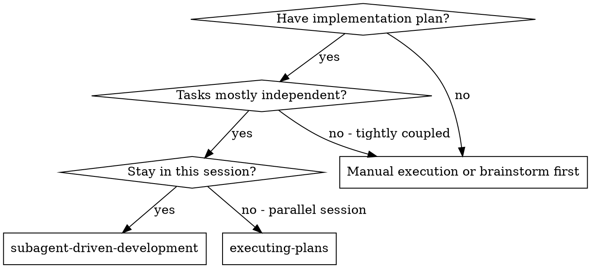
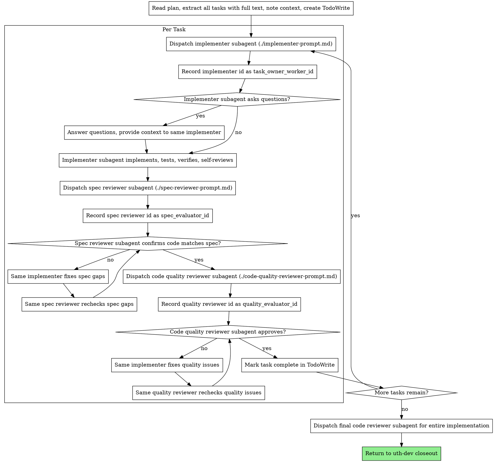

# Subagent-Driven Development

## UTH Boundary

This is a UTH-scoped method skill, not a top-level router.

- Use only after `uth-governance` or an owning `uth-*` scene selects it, or when the user explicitly names this skill.
- UTH owns scene routing, document locations, allowed writes, worker Prompt persistence, verification gates, and Git confirmation.
- Do not write project documentation by default. Write only to paths supplied by the owning UTH scene.
- Do not run Git writes, create commits, push, tag, merge, rebase, switch branches, or create/delete worktrees unless the owning scene is `uth-git` and the user has confirmed the Git plan.
- If this skill conflicts with an owning UTH scene, follow the UTH scene.


Execute an accepted UTH formal development plan by dispatching a fresh worker per task, with review after each task. The owning `uth-dev` scene remains the controller for prompts, write scopes, subagent identity, verification, Feedback, current-state, and Git handoff.

**Why subagents:** You delegate tasks to specialized agents with isolated context. By precisely crafting their instructions and context, you ensure they stay focused and succeed at their task. They should never inherit your session's context or history — you construct exactly what they need. This also preserves your own context for coordination work.

**Core principle:** Fresh subagent per task + owner fixes own work + issue author rechecks + two-stage review = high quality, fast iteration

## When to Use



**vs. Executing Plans (parallel session):**
- Same session (no context switch)
- Fresh subagent per task (no context pollution)
- Two-stage review after each task: spec compliance first, then code quality
- Faster iteration (no human-in-loop between tasks)

## Accountability Loop

The controller must keep a task-local accountability ledger before dispatching any fix loop:

- `task_owner_worker_id`: exact worker/subagent id or stable handle for the worker that produced the task output.
- `spec_evaluator_id` and `quality_evaluator_id`: exact evaluator/reviewer ids or stable handles for reviewers that raise findings.
- `finding_owner_map`: finding id -> originating worker id -> finding author evaluator id -> status.

Hard rule: whoever produced the problem fixes it; whoever raised the issue rechecks it.

- If evaluator A finds an issue in worker B's output, route the fix back to worker B. Do not assign the fix to a fresh worker or the controller.
- After worker B fixes, route the recheck back to evaluator A. Do not ask a fresh evaluator to approve A's finding.
- A finding is closed only when its original evaluator rechecks and marks it resolved, or the controller rejects the finding with explicit technical reasoning recorded for `uth-review`.
- If the platform cannot resume the same worker or evaluator, stop and ask the user before substituting a new agent. Record the substitution as an exception, not the normal path.

## The Process



## Model Selection

Use the least powerful model that can handle each role to conserve cost and increase speed.

**Mechanical implementation tasks** (isolated functions, clear specs, 1-2 files): use a fast, cheap model. Most implementation tasks are mechanical when the plan is well-specified.

**Integration and judgment tasks** (multi-file coordination, pattern matching, debugging): use a standard model.

**Architecture, design, and review tasks**: use the most capable available model.

**Task complexity signals:**
- Touches 1-2 files with a complete spec → cheap model
- Touches multiple files with integration concerns → standard model
- Requires design judgment or broad codebase understanding → most capable model

## Handling Implementer Status

Implementer subagents report one of four statuses. Handle each appropriately:

**DONE:** Proceed to spec compliance review.

**DONE_WITH_CONCERNS:** The implementer completed the work but flagged doubts. Read the concerns before proceeding. If the concerns are about correctness or scope, address them before review. If they're observations (e.g., "this file is getting large"), note them and proceed to review.

**NEEDS_CONTEXT:** The implementer needs information that wasn't provided. Provide the missing context and re-dispatch.

**BLOCKED:** The implementer cannot complete the task. Assess the blocker:
1. If it's a context problem, provide more context and re-dispatch with the same model
2. If the task requires more reasoning, re-dispatch with a more capable model
3. If the task is too large, break it into smaller pieces
4. If the plan itself is wrong, escalate to the human

**Never** ignore an escalation or force the same model to retry without changes. If the implementer said it's stuck, something needs to change.

## Prompt Templates

- `./implementer-prompt.md` - Dispatch implementer subagent
- `./spec-reviewer-prompt.md` - Dispatch spec compliance reviewer subagent
- `./code-quality-reviewer-prompt.md` - Dispatch code quality reviewer subagent

## Example Workflow

```
You: I'm using Subagent-Driven Development to execute this plan.

[Read plan or Todo path supplied by uth-dev]
[Extract all 5 tasks with full text and context]
[Create TodoWrite with all tasks]

Task 1: Hook installation script

[Get Task 1 text and context (already extracted)]
[Dispatch implementation subagent with full task text + context]
[Record worker id/handle as Task 1 owner]

Implementer: "Before I begin - should the hook be installed at user or system level?"

You: "User level (`$XDG_CONFIG_HOME/uth/hooks` or `~/.config/uth/hooks`)"

Implementer: "Got it. Implementing now..."
[Later] Implementer:
  - Implemented install-hook command
  - Added tests, 5/5 passing
  - Self-review: Found I missed --force flag, added it
  - Verified and reported changed files

[Dispatch spec compliance reviewer]
[Record reviewer id/handle as Task 1 spec evaluator]
Spec reviewer: ✅ Spec compliant - all requirements met, nothing extra

[Get git SHAs, dispatch code quality reviewer]
[Record reviewer id/handle as Task 1 quality evaluator]
Code reviewer: Strengths: Good test coverage, clean. Issues: None. Approved.

[Mark Task 1 complete]

Task 2: Recovery modes

[Get Task 2 text and context (already extracted)]
[Dispatch implementation subagent with full task text + context]
[Record worker id/handle as Task 2 owner]

Implementer: [No questions, proceeds]
Implementer:
  - Added verify/repair modes
  - 8/8 tests passing
  - Self-review: All good
  - Verified and reported changed files

[Dispatch spec compliance reviewer]
[Record reviewer id/handle as Task 2 spec evaluator]
Spec reviewer: ❌ Issues:
  - Missing: Progress reporting (spec says "report every 100 items")
  - Extra: Added --json flag (not requested)

[Send these findings back to the same implementer]
Implementer: Removed --json flag, added progress reporting

[Same spec reviewer reviews again]
Spec reviewer: ✅ Spec compliant now

[Dispatch code quality reviewer]
[Record reviewer id/handle as Task 2 quality evaluator]
Code reviewer: Strengths: Solid. Issues (Important): Magic number (100)

[Same implementer fixes]
Implementer: Extracted PROGRESS_INTERVAL constant

[Same code reviewer reviews again]
Code reviewer: ✅ Approved

[Mark Task 2 complete]

...

[After all tasks]
[Dispatch final code-reviewer/evaluator if uth-dev requested it]
Final reviewer: Requirements checked; return to uth-dev for closeout, Feedback, current-state, and Git recommendation.

Done!
```

## Advantages

**vs. Manual execution:**
- Subagents follow TDD naturally
- Fresh context per task (no confusion)
- Parallel-safe (subagents don't interfere)
- Subagent can ask questions (before AND during work)

**vs. Executing Plans:**
- Same session (no handoff)
- Continuous progress (no waiting)
- Review checkpoints automatic

**Efficiency gains:**
- No file reading overhead (controller provides full text)
- Controller curates exactly what context is needed
- Subagent gets complete information upfront
- Questions surfaced before work begins (not after)

**Quality gates:**
- Self-review catches issues before handoff
- Two-stage review: spec compliance, then code quality
- Review loops ensure fixes actually work
- Spec compliance prevents over/under-building
- Code quality ensures implementation is well-built

**Cost:**
- More subagent invocations (implementer + 2 reviewers per task)
- Controller does more prep work (extracting all tasks upfront)
- Review loops add iterations
- But catches issues early (cheaper than debugging later)

## Red Flags

**Never:**
- Start implementation on main/master branch without explicit user consent
- Skip reviews (spec compliance OR code quality)
- Proceed with unfixed issues
- Dispatch multiple implementation subagents in parallel (conflicts)
- Lose track of which worker produced a task result
- Send a review finding to a different worker than the one who produced the faulty output
- Ask a different evaluator to approve a finding raised by the original evaluator
- Make subagent read plan file (provide full text instead)
- Skip scene-setting context (subagent needs to understand where task fits)
- Ignore subagent questions (answer before letting them proceed)
- Accept "close enough" on spec compliance (spec reviewer found issues = not done)
- Skip review loops (reviewer found issues = implementer fixes = review again)
- Let implementer self-review replace actual review (both are needed)
- **Start code quality review before spec compliance is ✅** (wrong order)
- Move to next task while either review has open issues

**If subagent asks questions:**
- Answer clearly and completely
- Provide additional context if needed
- Don't rush them into implementation

**If reviewer finds issues:**
- Implementer (same subagent / same worker id) fixes them
- Reviewer who raised the issue reviews again
- Repeat until approved
- Don't skip the re-review

**If subagent fails task:**
- Dispatch fix subagent with specific instructions
- Don't try to fix manually (context pollution)

## Integration

**Workflow skills, only when selected by the owning UTH scene:**
- **uth-sp-using-git-worktrees** - Set up isolated workspace only when `uth-dev` / `uth-git` approves it
- **uth-sp-writing-plans** - Creates the plan this skill executes
- **uth-sp-requesting-code-review** - Code review template for reviewer subagents

**Subagents should use:**
- **uth-sp-test-driven-development** - Subagents follow TDD for each task

**Alternative workflow:**
- **uth-sp-executing-plans** - Use for inline execution when the owning UTH scene chooses it
